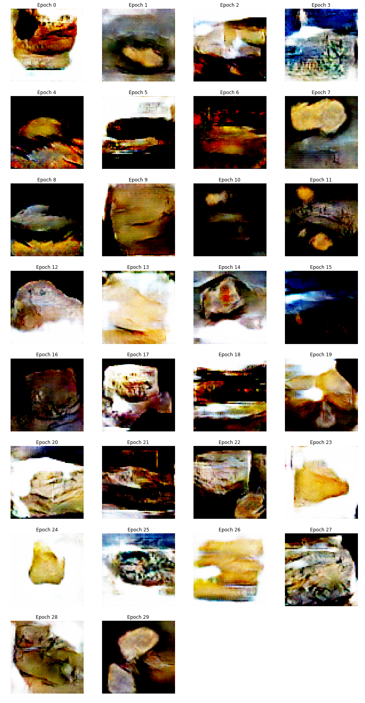

# Cheese Classifier

Classify cheese with the help of the fastai library. Based on the [cougar-or-not](https://github.com/simonw/cougar-or-not) project by Simon Willison.

## Examples

Comté: https://cc.de-souza.eu/classify-url?url=https://upload.wikimedia.org/wikipedia/commons/thumb/2/2a/Comte_AOP.jpg/1024px-Comte_AOP.jpg

Roquefort: https://cc.de-souza.eu/classify-url?url=https://upload.wikimedia.org/wikipedia/commons/thumb/8/88/Morceau_de_Roquefort_Coulet.jpg/1024px-Morceau_de_Roquefort_Coulet.jpg

## Generative Adversarial Network (GAN)

A GAN may be trained on the same dataset to generate artificial cheese images:

